# Hao的AI智能刷题项目

### 项目介绍 🔥

- 此项目是基于**SpringCloud微服务 + Vue3+ts+uniapp**开发的AI智能刷题项目
- 项目包含后台，h5，后端2个网关，4个服务
- 项目功能多，AI功能亮点多极其有创意
- 后端架构设计规范前端页面简洁美观有创意
- 项目自主研发从0-1设计的
- 技术和环境都是最新的
- 全网首创的AI使用场景

### 项目亮点 ⚡

- 使用**Redis**刷题次数排行榜提升响应速度
- 使用**Redis**实现分布式锁防止消息重复消费
- 使用**Rabbitmq**异步生成AI答案提升响应速度
- 使用**Rabbitmq**异步通过AI服务审核会员题目无需人工
- 使用**Minio**存储专题图片存储免费好用
- 使用**SpringTask**实现每日刷题题目动态推荐用户专属题目提高用户留存率
- 使用**阿里云百炼TTS**语音合成技术朗读面试题内容提升用户刷题兴趣
- 使用**SpringAi**接入阿里云百炼api接口进行对话有免费额度
- 使用**Echarts**仿力扣分类气泡图展示题目分类和数量有创意
- 使用**Echarts**仿gitee日历热点图展示用户每日刷题次数提高用户刷题率
- 使用**Security**严格控制角色权限保障会员权益


### 项目收获 🔨

- 收获**Redis**缓存
- 收获**Rabbitmq**消息队列
- 收获**SpringTask**定时任务
- 收获**SpringCloud**微服务设计
- 收获**Nacos**配置中心与注册中心
- 收获**SpringAi**与AI对话
- 收获**SpringSecurity**权限管理
- 收获**OpenFeign**远程调用
- 收获**MybatisPlus**操作数据库
- 收获**Gateway**路由转发
- 收获**Vue3**前端框架
- 收获**AntDv**UI框架
- 收获**Uniapp**多端开发技术
- 收获**Echats**图表设计
- 收获**Uv-ui**手机端UI框架
- 收获**Tts**语音合成技术的使用

### 运行环境 🗄️

h5端： Vue3 + Uv-ui + Uniapp + Zero-markdown-view...

后台： Vue3 + AntDv + Echarts + Ts + Md-editor-v3....

后端： JDK17 + SpringBoot3.2 + SpringCloud2023 + Nacos + Gateway + OpenFeign + SpringTask +  Mysql + Redis + RabbitMQ + Minio + Mybatis-Plus....

##### 前端

**以下需要版本要求其他技术版本新一点就可以**

| 名称 | 环境 |
| ---- | ---- |
| Npm  | 10+  |
| Vue3 | 3+   |
| Node | 18+  |

##### 后端

**以下需要版本要求其他技术版本新一点就可以**

| 名称          | 环境  |
| ------------- | ----- |
| MySQL         | 8.0.13+ |
| JDK           | 17    |
| SpringBoot    | 3.2   |
| SpringCloud   | 2023  |
| SpringAi      |1.0.0-M6|

### 项目效果 👀

哔哩哔哩视频效果演示地址：[https://space.bilibili.com/1680425641?spm_id_from=333.788.0.0](https://space.bilibili.com/1680425641?spm_id_from=333.788.0.0)

##### 后台
**大屏**

 

**管理员首页** 

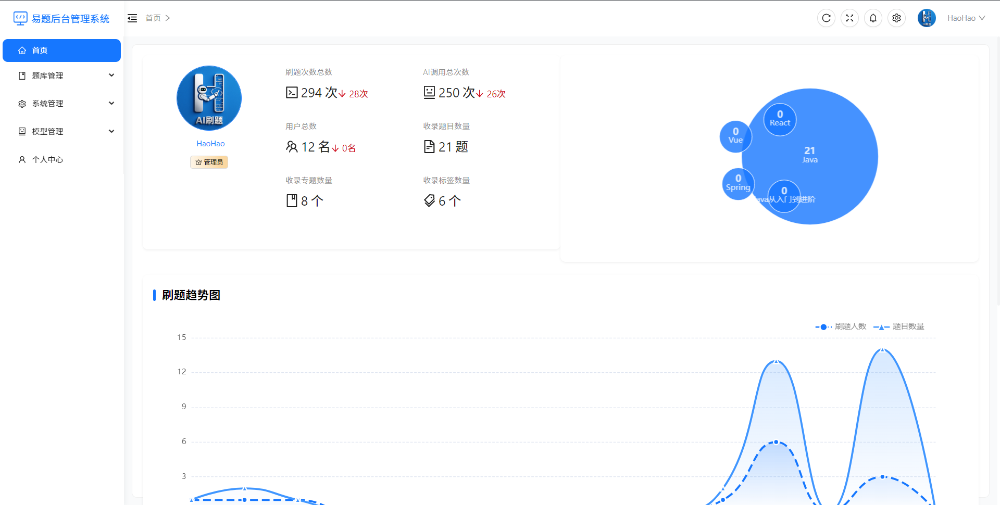
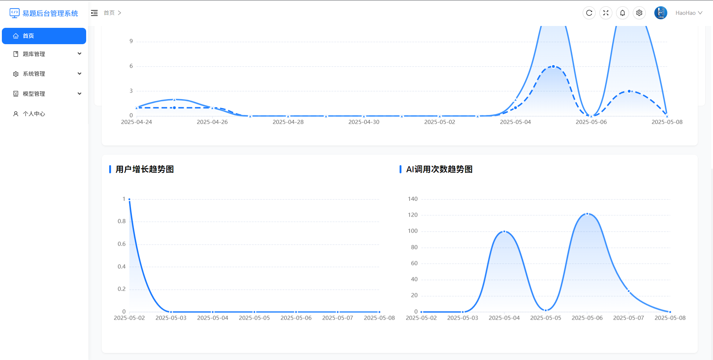

**用户首页** 

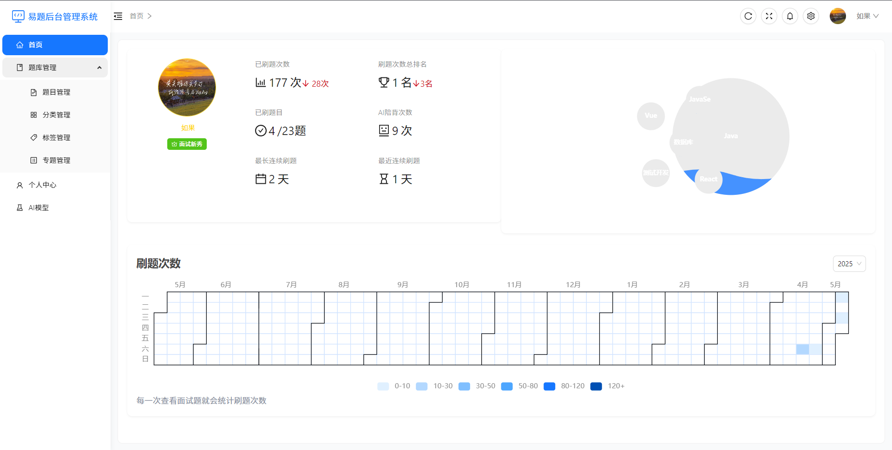

**AI刷题页面** 

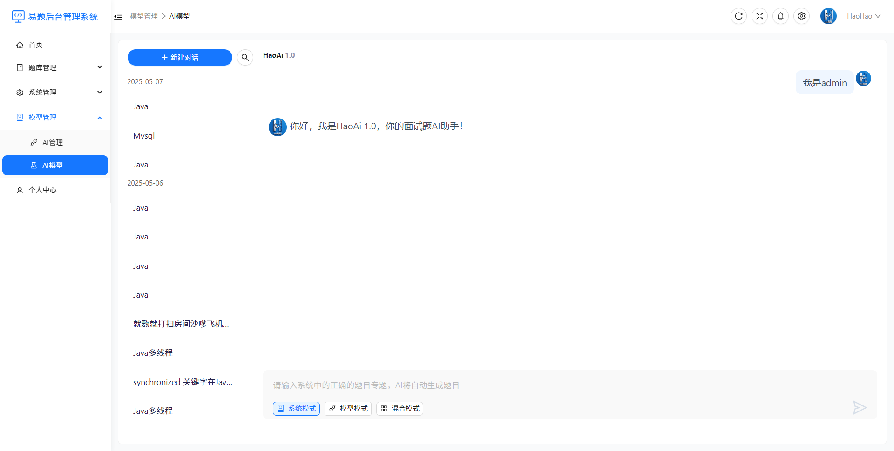
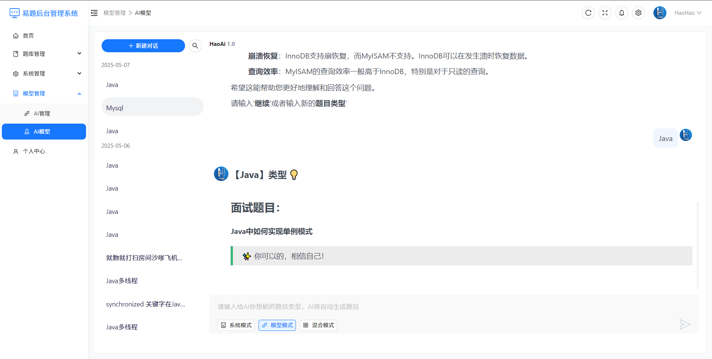

**项目结构**

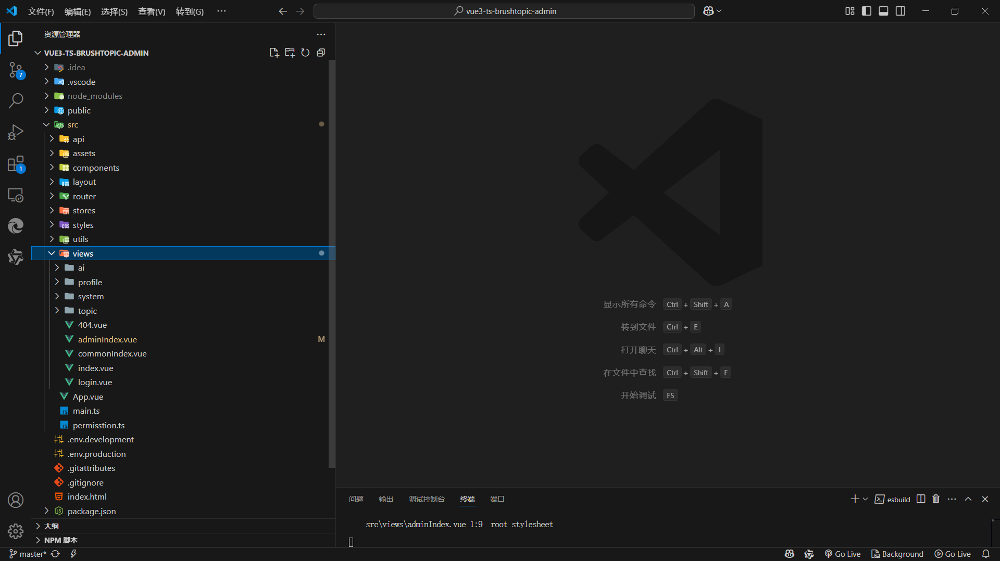

##### 后端

**项目结构**

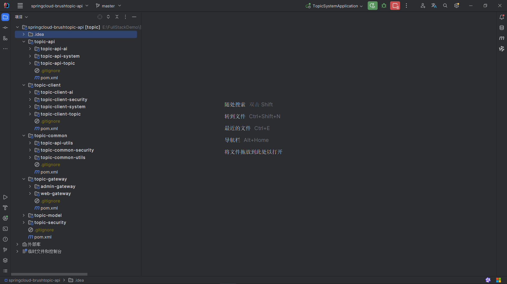

##### h5

**首页**

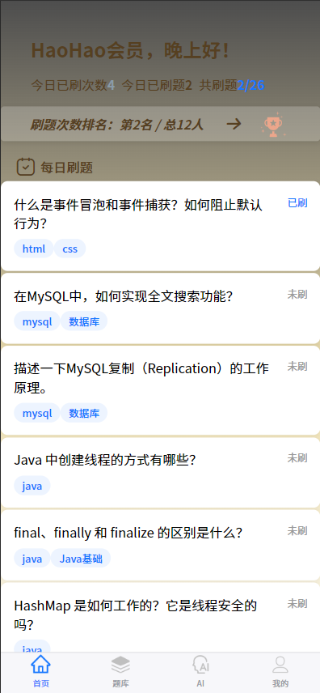

**排行榜**

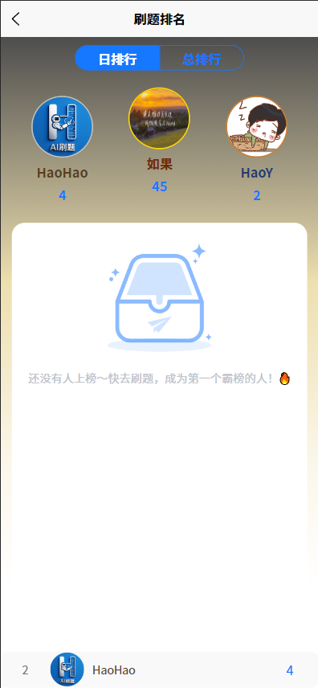

**题库页面**

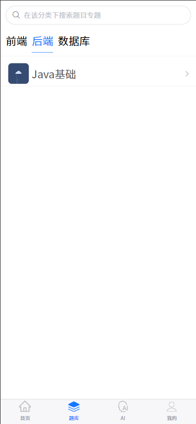

**题目页面**

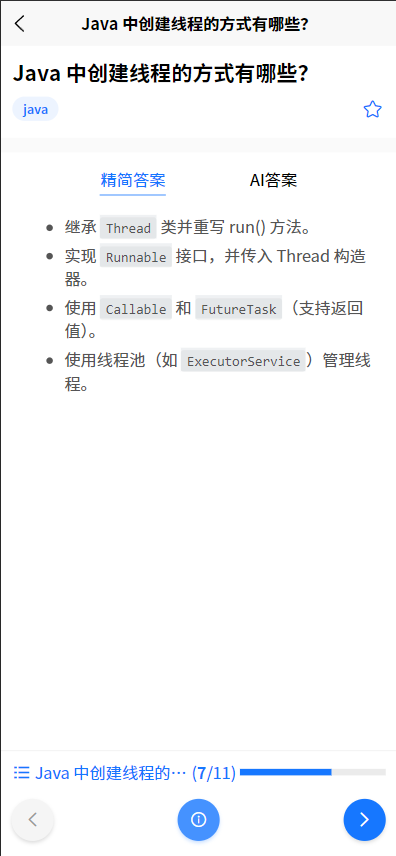

**AI刷题页面**

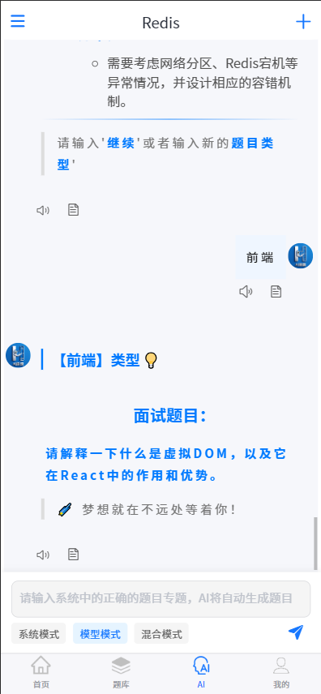

**我的页面（用户）**

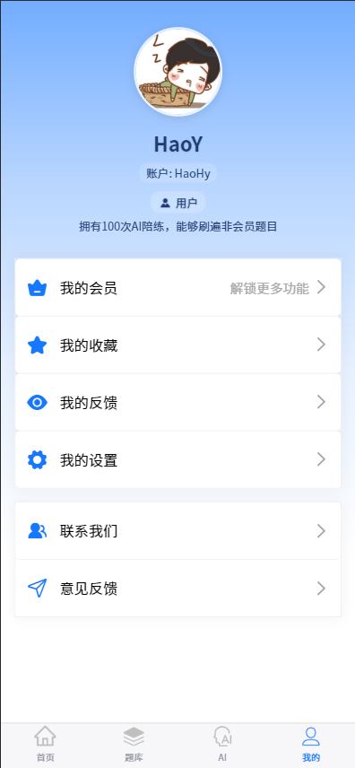

**我的页面（会员）**

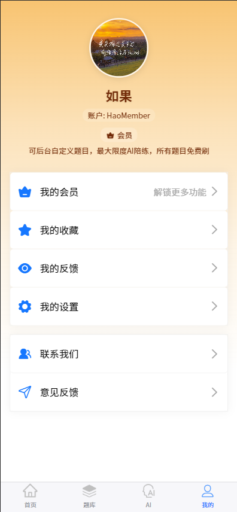

**我的页面（管理员）**

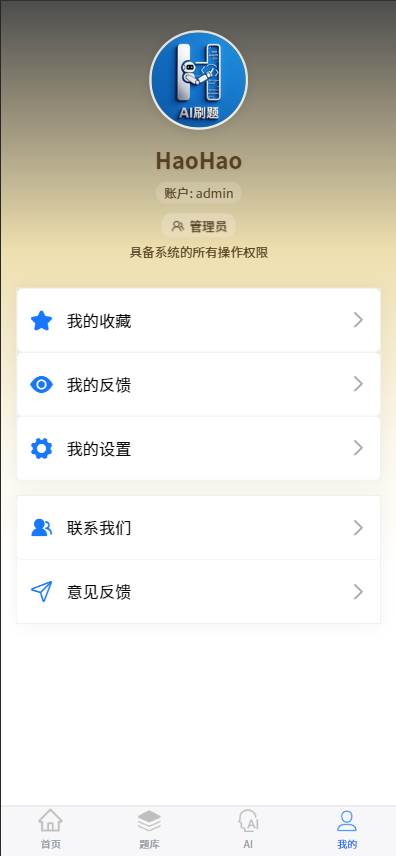


### 使用事项 📔

- 如需部署服务器配置得8g以上
- 如需要作者启动请联系作者
- 如有启动问题请联系作者
- 如有问题请联系作者

##### 联系方式

**QQ**: 3655161743

**WX**:	H9498426

##### 交流群码

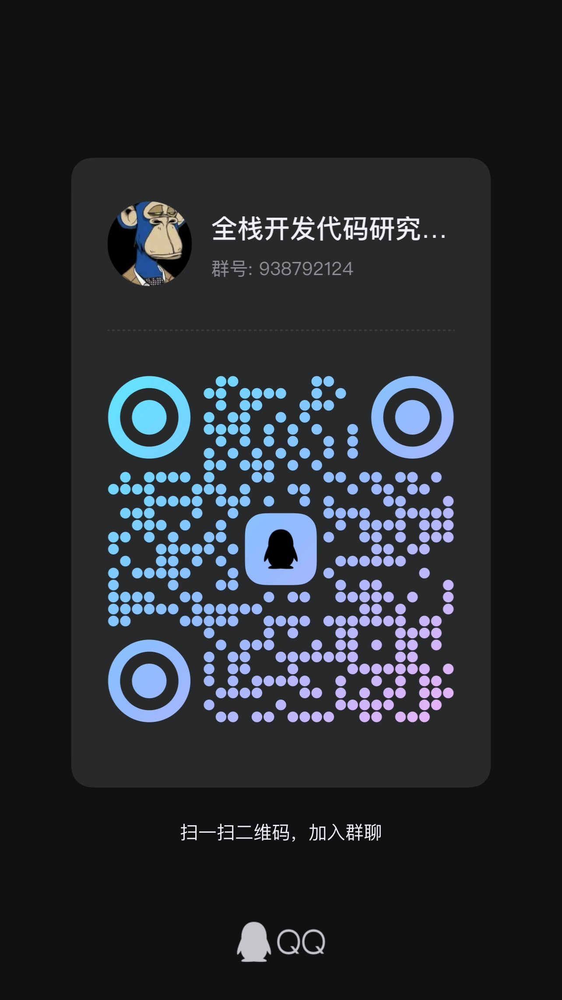

### 项目启动 🚀

##### h5
**uni-app-vue3-brushtopic**文件夹
```
npm install
用HBuilder启动
```

##### 后台
**vue3-ts-brushtopic-admin**文件夹
```
npm install
npm run dev
```

##### 后端
**springcloud-brushtopic-api**文件夹

- 打开项目 配置jdk17 加载maven依赖
- 安装mysql redis mq nacos minio
- 安装完nacos后需要将配置文件文件夹中的配置文件导入到nacos中
- 打开common-config配置文件需要配置自己的
- 打开common-minio配置文件需要配置自己的
- 打开service-ai配置文件配置自己的阿里云百炼sk
- 安装完minio后需要创建topic桶并开放public权限
- 将sql文件夹中的sql放入到你的数据库中启动！


### 项目问题 🧩

**待反馈** 


### 项目捐赠 🍵

觉得做的还可以 对你的灵感和技术业务有帮助的话以及喜欢这个项目的可以通过以下方式支持我：

- Star和Fork 
- 哔哩哔哩视频一键三连支持
- 通过微信、支付宝一次性打赏或捐赠作者 谢谢各位ma友赏饭吃 你的鼓励 是我最大的动力

| 支付宝                                                         | 微信                                                       |
| ------------------------------------------------------------ | ------------------------------------------------------------ |
|  ||

### 项目计划 🔄

##### 后台大屏设计（已完善）
- 大屏页面顶部左侧**展示不同等级用户的分布情况饼图**
- 大屏页面顶部右侧**用户使用率系统使用率系统空闲率饼图**
- 大屏界面中部**飞线图**
- 大屏界面左中**刷题量top10柱状图**
- 大屏界面右中**活跃用户top10柱状图**
- 大屏界面左下**用户xx刚刷了10道题使用无限滚动**
- 大屏界面右下**用户xx刚跟AI陪背了**

### 后续计划 📚

- 沉淀


